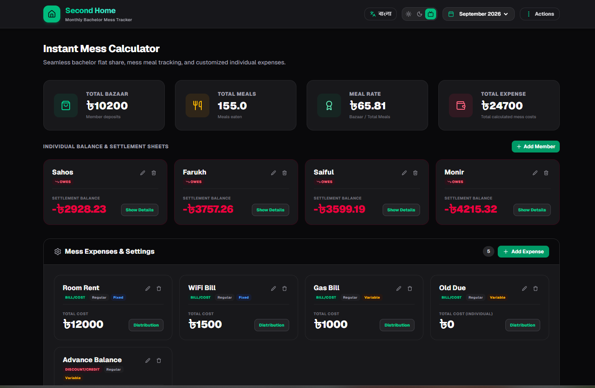

# Second Home (সেকেন্ড হোম) — Monthly Bachelor Mess Tracker

**Second Home** is a modern, client-side web application designed for seamless bachelor flat sharing, mess meal tracking, individual balance calculations, and custom expense management. Built with zero backend overhead, all data is safely calculated and persisted in your browser's local storage.

---

## 📸 Application Screenshots & Visual Overview

### 1. Main Dashboard (`Dashboard.png`)
The primary interface provides a real-time overview of the mess's financial health and member balances.



**Key Features & Components:**
* **Header & Controls:** Toggle between Bangla and English (`বাংলা` / `English`), switch dark/light/system themes, select monthly tracking cycles, and access global actions (data import/export, reset).
* **KPI Metrics Summary:**
  * **Total Bazaar:** Cumulative deposits made by all members for grocery/bazaar.
  * **Total Meals:** Sum of all meals consumed across members.
  * **Meal Rate:** Automatically calculated as `Total Bazaar / Total Meals`.
  * **Total Expense:** Sum of all fixed/variable shared mess expenses.
* **Individual Balance & Settlement Sheets:** Member cards displaying real-time settlement balances (`OwES` / `REFUND`). Expandable details show transparent step-by-step breakdown equations.
* **Mess Expenses & Settings:** Interactive expense cards showing total costs, occurrence flags (Regular / One-Time), reset behaviors (Fixed / Variable), and custom distribution settings.

---

### 2. Member Management & Edit Modal (`edit member.png`)
Easily manage individual member statistics, deposits, meals, and individual custom fees.


**Key Features & Fields:**
* **Full Name:** Update member display name.
* **Bazaar Deposit (৳):** Amount deposited by the member for collective mess groceries/bazaar.
* **Meals Eaten:** Number of meals consumed during the month.
* **Individual Custom Fees / Adjustments:**
  * **Old Due (Bill/Cost):** Previous month's outstanding due balance attributed directly to this member.
  * **Advance Balance (Discount/Credit):** Advance payments or credits applied to reduce this member's final balance.

---

### 3. Expense Management & Edit Modal (`expence edit.png`)
Configure granular rules for mess utilities, rent, and custom charges.


**Key Features & Options:**
* **Expense Name:** Name of the utility or bill (e.g., Room Rent, WiFi Bill, Gas Bill).
* **Expense Occurrence:**
  * **Regular:** Recurring monthly expense.
  * **One-Time:** Single-instance charge for the current cycle.
* **Reset Behavior:**
  * **Fixed:** Preserves default amounts during month transitions/soft resets.
  * **Variable:** Zeroes out amounts when starting a new month cycle.
* **Expense Type:**
  * **Bill/Cost:** Adds to the overall cost burden.
  * **Discount/Credit:** Reduces total expenses or distributes savings.
* **Split Type:**
  * **Equal Split:** Shared equally across all active members.
  * **Individual:** Customized per-member allocations.
* **Default Total Lump-Sum (৳):** Standard cost applied when calculating equal splits.
* **Note (Optional):** Temporary monthly reminder note (e.g., meter readings or bill account numbers).

---

## ✨ Key Features

* ⚡ **Zero-Backend Architecture:** Instant performance with local calculations and `localStorage` state persistence.
* 🌐 **Bilingual Support:** Full English and Bangla (`বাংলা`) translation support.
* 🌓 **Dark & Light Mode:** Custom theme switcher with dark mode optimized UI elements.
* 📊 **Transparent Ledger Equations:** Step-by-step mathematical breakdown for member settlement verification.
* 📄 **Report Exporting:** Client-side high-resolution PNG image summary (via HTML Canvas) and PDF report generation (via `jsPDF`).
* 🔄 **Flexible Month Resets:** Dual-mode reset functionality (Soft Reset preserving fixed setups vs. Hard Reset for fresh starts).

---

## 🛠️ Tech Stack

* **Framework:** [Next.js](https://nextjs.org/) (App Router, Client Components)
* **Language:** [TypeScript](https://www.typescriptlang.org/)
* **Styling:** [Tailwind CSS v4](https://tailwindcss.com/)
* **Icons:** [Lucide React](https://lucide.dev/)
* **PDF Generation:** [jsPDF](https://github.com/parallax/jsPDF)

---

## 🚀 Getting Started

First, clone the repository and install the dependencies:

```bash
npm install
```

Run the development server:

```bash
npm run dev
```

Open [http://localhost:3000](http://localhost:3000) with your browser to view the application.

### Available Scripts

* `npm run dev` — Starts the development server.
* `npm run build` — Compiles the production build.
* `npm run start` — Runs the compiled production app.
* `npm run lint` — Runs ESLint checks across the project.
